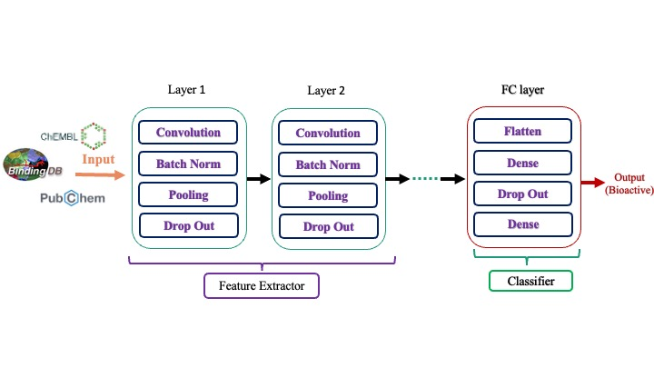

# Machine Learning for Drug Design Roadmap
Explore the comprehensive roadmap for leveraging machine learning in drug design.
\
This repository not only navigates you through the fundamental toolkit for machine learning in Python, encompassing libraries crucial for data handling and indispensable for cheminformatics, but also recommends online courses and books that have been encountered during my journey to master ML models for drug design applications. Furthermore, it includes a collection of projects and hands-on tutorials, addressing applications in ML in general and specifically in drug design, such as virtual screening and docking.

## Software List
The majority of the code presented in this repo can be implemented and executed using the open-source MLflow tool. The following outlines some key software packages included in my roadmap for utilizing ML models in drug design.
- Python 3.11.5
- Pandas 2.1.1
- Scikit-Learn 1.2.2
- TensorFlow 2.14.0
- Keras 2.12.0

## [1. ML Toolkit ](1_ML_Toolkit) 
In this section we delve into essential tools for handling big data with ML models such as : 
### [1.1 TensorFlow (Keras) ](1_ML_Toolkit/keras)
### [1.2 PyTorch ](1_ML_Toolkit/PyTorch)
### [1.3 RDKit ](1_ML_Toolkit/RDKit)
### [1.4 Pandas ](1_ML_Toolkit/Pandas)
### [1.5 Matplotlib ](1_ML_Toolkit/Matplotlib)
### [1.6 Seaborn ](1_ML_Toolkit/Seaborn)

## [2. Code Assignments and Learning Materials ](2_CodeAssignments_and_LearningMaterials) 
In this section, I am sharing the practical knowledge gained on my journey to master ML models for Drug Design. Having extensively studied various books and completed numerous online courses across different platforms. 

## [3. Full Scale ML Projects Showcase ](3_Full-Scale_ML_ProjectsShowcase) 
In this section, completed a set of complete ML projects and real case studies, including topics like car price prediction, image classification, and recommendation systems.

## [4. Practical Drug Design applications ](4_Practical_DrugDesign_applications) 
In this section,  I am sharing numerous projects and hands-on applications focused on drug design activities, such as virtual screening and docking.